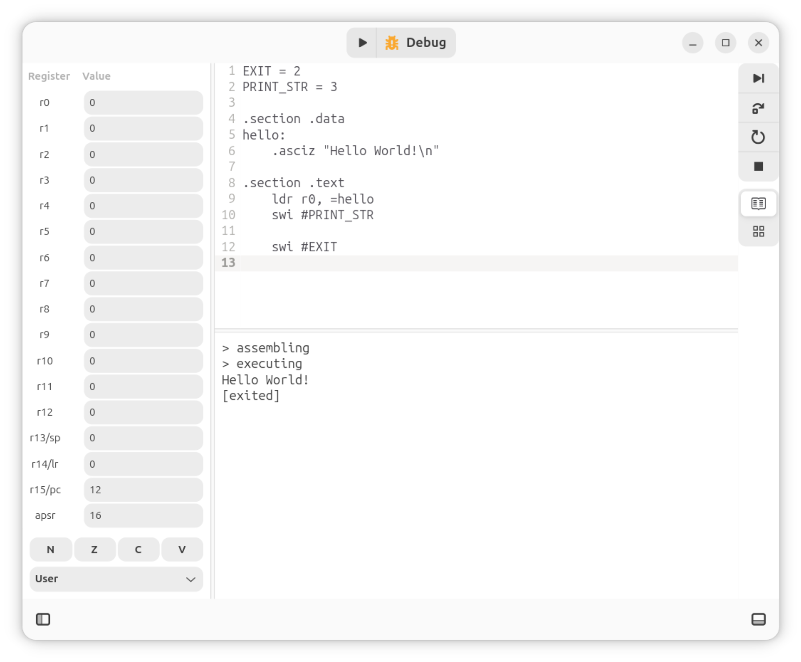

# Komodo

Komodo is a graphical debugger for ARMv4 assembly designed for education.



This project is written in rust and uses `gtk4` and `libadwaita` rust crates for the UI. As well as `goblin` to parse ELF files and `capstone` as a disassembly framework.

# Development

First install development libraries, which is done on Debian/Ubuntu with:

```shell
sudo apt install pkg-config libgtk-4-dev libadwaita-1-dev libgtksourceview-5-dev desktop-file-utils gcc gtk-update-icon-cache -y
```

GNU Binutils must also be available at runtime:

```shell
sudo apt install binutils-arm-linux-gnueabi y
```

Run the program with cargo:

```shell
cargo run --bin gtk-app
```

Run the CLI with cargo:

```shell
cargo run --bin cli
```

Run tests with cargo:

```shell
cargo test
```

For development, it may be helpful to install the following tools:

```shell
sudo apt install libadwaita-1-examples -y
# run with `adwaita-1-demo`

flatpak install org.gnome.design.IconLibrary
# run with `flatpak run org.gnome.design.IconLibrary`
```

Also see [rust book](https://doc.rust-lang.org/stable/book/) and [gtk-rs book](https://gtk-rs.org/gtk4-rs/stable/latest/book/).

# Quickstart

Several example programs are available in the [examples/](examples/) folder including [examples/hello.s](examples/hello.s):

```asm
EXIT = 2
PRINT_STR = 3

.section .data
hello:
    .asciz "Hello World!\n"

.section .text
    ldr r0, =hello
    swi #PRINT_STR

    swi #EXIT
```

The compile time constants (`EXIT` and `PRINT_STR`) as well as `.section` and `.asciz` directive are features of the GNU assembler `as`. They are documented in [section 5.2](https://sourceware.org/binutils/docs/as/Setting-Symbols.html) and [section 7](https://sourceware.org/binutils/docs/as/Pseudo-Ops.html) of the user guide.

Five system calls are available, taken from [original komodo](https://studentnet.cs.manchester.ac.uk/resources/software/komodo/manual.html):

|Instruction|Behaviour|
|-|-|
|`swi 0`|Prints the least significant byte of `r0` as a character|
|`swi 1`|Read in character from user to the significant byte of `r0`|
|`swi 2`|Halts execution|
|`swi 3`|Prints a string, pointed to by `r0`|
|`swi 4`|Prints the value of `r0` as decimal|
